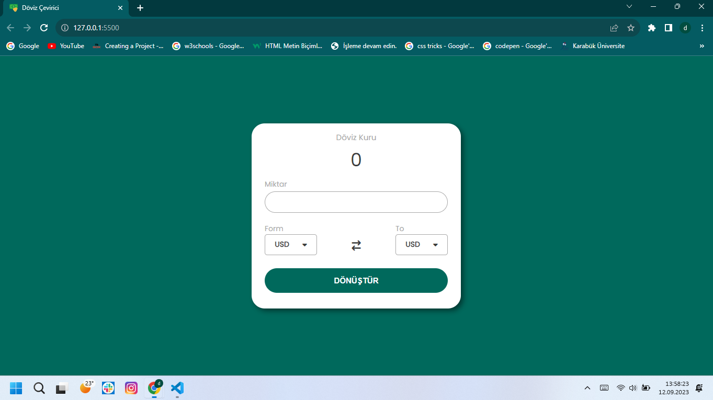
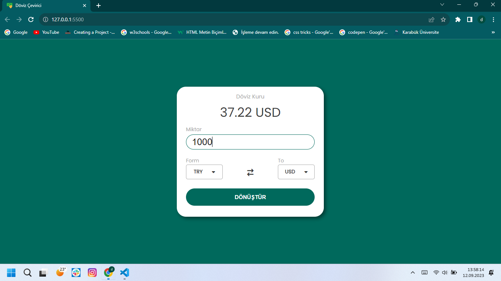
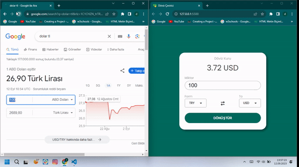

# Currency-Converter

Currency-Converter Projesi 

Currency Converter Projesi
Bu proje, farklı para birimlerinin dönüşümünü gerçekleştiren bir para birimi dönüştürücü uygulamasını içerir. Bu uygulama, kullanıcıların bir para birimini diğerine dönüştürmelerine olanak tanır. Aynı zamanda güncel döviz kurlarını çevrimiçi olarak alabilir ve kullanıcılara doğru ve güncel dönüşüm sonuçları sunar.

Özellikler
Farklı para birimleri arasında dönüşüm yapabilme.
Güncel döviz kurlarını alabilme.
Kullanıcı dostu bir arayüze sahip olma.
Kullanıcıların dönüşüm geçmişini kaydedebilme.
Başlarken
Bu projeyi yerel ortamınızda çalıştırmak ve geliştirmek için aşağıdaki adımları izleyebilirsiniz.

Bu deposu yerel makinenize kopyalayın:

bash
Copy code
git clone https://github.com/DurmusFSD/Currency-Converter.git
Proje klasörüne gidin:

bash
Copy code
cd currency-converter
Gerekli bağımlılıkları yükleyin:

bash
Copy code
npm install
Uygulamayı başlatın:

bash
Copy code
npm start
Tarayıcınızı açın ve http://localhost:3000 adresine gidin.

Kullanım
Uygulama başladığında, dönüştürmek istediğiniz para birimlerini seçin. Miktarı girin ve dönüştür düğmesine tıklayın. Uygulama güncel döviz kurlarını kullanarak dönüşüm sonucunu gösterecektir.

Katkıda Bulunma
Eğer bu projeye katkıda bulunmak isterseniz, lütfen aşağıdaki adımları izleyin:

Bu projeyi forklayın.
Yeni bir özellik veya hata düzeltmesi ekleyin.
Değişikliklerinizi yapın ve düzenli bir şekilde commit'leyin.
Bir pull isteği (pull request) açın ve değişikliklerinizi tartışmaya açın.
Lisans
Bu proje MIT lisansı altında lisanslanmıştır. Daha fazla bilgi için LICENSE dosyasına bakın.

İletişim
Eğer herhangi bir sorunuz veya geri bildiriminiz varsa, lütfen [durmusozgul66@gmail.com] adresi üzerinden bizimle iletişime geçin.

Teşekkürler
Bu projeyi kullanmayı tercih ettiğiniz için teşekkür ederiz!

Durmuş Özgül
